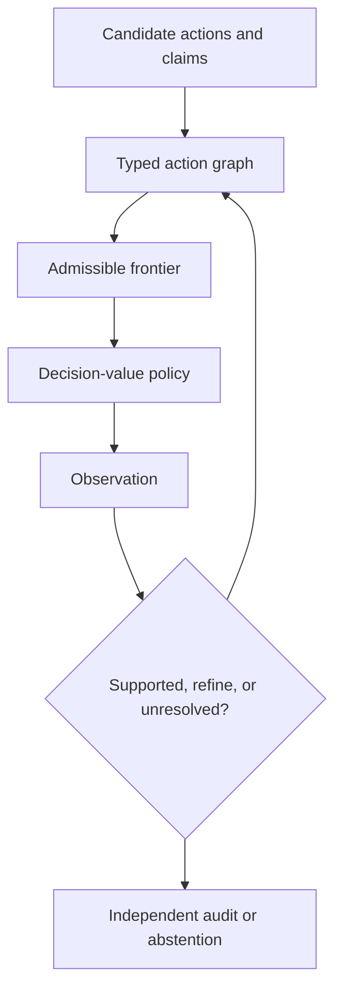

# Metamorpher

> **Research prototype.** Metamorpher reports what is supported relative to a
> supplied graph, evidence ledger, policy, and assumptions. It does **not**
> certify truth, physical safety, regulatory compliance, or production
> readiness. Do not use it as an autonomous authority in medical, automotive,
> industrial, legal, financial, security, or other high-stakes systems.

Metamorpher is an executable reference implementation for
**frontier-constrained, evidence-revising agent control**. It separates five
questions that language models and conventional scalar policies often entangle:

1. What actions might be relevant?
2. Which actions are admissible under the current model?
3. Which admissible action has the highest downstream decision value?
4. What did the resulting observation change?
5. Is the present representation sufficient, unresolved, or in need of
   refinement?

The core is deterministic, inspectable, uses only the Python standard library,
and runs on CPU. An optional CUDA/Triton backend is intended to accelerate large
batches without changing these semantics.

## Install

From this directory:

```bash
python -m pip install -e .
metamorpher doctor
```

Optional numerical and accelerator dependencies:

```bash
python -m pip install -e ".[numpy]"
python -m pip install -e ".[cuda]"
```

CUDA is never required. If CUDA, PyTorch, or Triton is unavailable, the package
falls back to the CPU reference path. Use `metamorpher doctor --json` for a
machine-readable environment report.

## Five-minute tour

Run the deterministic Sierra simulation:

```bash
metamorpher demo sierra
metamorpher demo sierra --trace run.jsonl
```

The demonstration starts with several mechanically relevant actions, but the
cheap fastener inspection wins the initial frontier. Observing a missing
fastener changes the admissible repair branches before an expensive manifold or
gasket intervention is selected. This is a simulation of controller semantics,
not vehicle repair advice.

The lower-level Python API is intentionally small:

```python
from metamorpher import (
    ActionKind,
    ActionNode,
    Constraint,
    ConstraintKind,
    ControllerState,
    EvidenceLedger,
    HeuristicLookaheadPolicy,
    TypedActionGraph,
)

graph = TypedActionGraph()
graph.add_node(ActionNode("inspect", "Inspect first", ActionKind.OBSERVE,
                          information_value=5.0))
graph.add_node(ActionNode("repair", "Repair", ActionKind.REPAIR,
                          cost=10.0, reversible=False))
graph.add_constraint(Constraint(
    "inspect-before-repair",
    ConstraintKind.HARD_PREREQUISITE,
    ("inspect",),
    "repair",
))
graph.validate()

state = ControllerState()
evidence = EvidenceLedger()
frontier = graph.frontier(state, evidence)
action = HeuristicLookaheadPolicy().select(graph, state, frontier.certified)
print(action)  # inspect
```

See [`examples/basic.py`](examples/basic.py) for a runnable version.

The high-level controller uses an explicit decision/commit/observe handshake:

```python
from metamorpher import MetamorpherController, Observation

controller = MetamorpherController(graph)
decision = controller.next()
node = controller.commit(decision)

# The caller—not Metamorpher—runs `node` in an external environment.
observation = Observation(
    id="result-1",
    key="inspection_result",
    value="observed value",
    source="authorized adapter",
    action_token=decision.token,
)
controller.observe(observation, token=decision.token)
```

`commit` binds the decision token and action; it still does not execute the
external action. A new graph epoch or evidence revision makes an older decision
stale.

## Controller contract

Metamorpher uses deliberately narrow decision states:

- `supported_under_model`: the action is admissible and selected under the
  current graph, evidence, domain, and policy.
- `refinement_required`: a relevant prerequisite or guard remains unresolved,
  and a represented probe may improve the decision.
- `abstain`: the represented hypotheses do not share a sufficiently supported
  action.

Execution is separate from decision support. The reference CLI never performs
external repairs, writes to production systems, or treats a high score as
permission to bypass a hard prerequisite.

## Core invariants

- The value policy ranks only the admissible frontier.
- Hard prerequisites are structurally gated, not learned as correlations.
- `unobserved` and `censored` do not mean `absent`.
- Contradictory observations remain in an append-only evidence history.
- Unidentifiable cases may remain unresolved indefinitely.
- An unresolved equivalence class produces a common-safe action or abstention;
  it does not require an invented explanation.
- Reusable learned claims are tagged with their domain and provenance.
- Invalid or cyclic structural revisions fail closed.
- Event traces support deterministic inspection and can be loaded by replay
  tooling.

These invariants make failure modes visible; they do not make an incomplete or
incorrect model true.

## Architecture



The graph carries hard prerequisites, guards, alternatives, mutual exclusions,
and soft epistemic preferences. The evidence ledger preserves provenance and
censoring. Version spaces preserve multiple observationally equivalent
hypotheses until evidence supports a split. Domain-tagged memory and independent
audits reduce self-confirming reuse of incomplete structure.

Read [`docs/architecture.md`](docs/architecture.md) for the complete control
semantics and [`docs/safety.md`](docs/safety.md) before integrating any external
system.

## CPU, CUDA, and Triton

The CPU implementation is the semantic reference and the right default for
single or small graphs. CUDA/Triton acceleration targets batches of many
independent controller states where transfer and compilation costs can be
amortized. Hard frontier masks remain discrete structural operations; floating
point value scores never override them.

Backend selection must be observationally equivalent to the reference path
within documented numeric tolerances. Automatic selection tries Triton/CUDA,
then vectorized NumPy on CPU, then the dependency-free CPU reference. See
[`docs/cuda-triton.md`](docs/cuda-triton.md).

Run backend parity tests with:

```bash
python -m unittest discover -s tests -p "test_backends.py" -v
```

Run a local end-to-end batch microbenchmark, including Python-to-backend input
conversion, with:

```bash
python - <<'PY'
from time import perf_counter
from metamorpher.backends import get_backend

B, A, F = 512, 16, 7
pending = [[1] * A for _ in range(B)]
completed = [[0] * A for _ in range(B)]
prerequisites = [[[0] * A for _ in range(A)] for _ in range(B)]
features = [[[float((b + a + f) % 11) for f in range(F)]
             for a in range(A)] for b in range(B)]
weights = [1.0] * F

for name in ("reference", "numpy", "triton"):
    try:
        backend = get_backend(name, strict=True)
    except RuntimeError as error:
        print(f"{name:>9}: skipped ({error})")
        continue
    backend.frontier_and_score(pending, completed, prerequisites, features, weights)
    start = perf_counter()
    for _ in range(10):
        backend.frontier_and_score(pending, completed, prerequisites, features, weights)
    print(f"{name:>9}: {(perf_counter() - start) / 10:.6f} s/batch")
PY
```

**Validation status for this source snapshot:** the dependency-free and NumPy
paths were executed and compared in the development environment. No compatible
CUDA runtime was available, so the Triton kernels remain unexecuted here. Treat
that path as experimental until the parity suite passes on the target CUDA
device; record GPU, driver, PyTorch, and Triton versions with any benchmark.

## Project status and non-goals

Version 0.1 is a research kernel and benchmark harness. It does not yet claim to
solve:

- reliable graph or ontology induction from natural language;
- causal discovery of never-observed variables;
- calibrated real-world competence boundaries;
- adversarial tool or prompt security;
- formal verification of external actions;
- production-grade distributed persistence or authorization;
- validation in any regulated domain.

An LLM may propose candidate nodes, edges, tests, or scores through an adapter,
but those proposals are untrusted inputs to the controller.

## Develop

The complete behavioral suite runs with the standard library:

```bash
python -m unittest discover -s tests -v
```

Install the developer extra for coverage, linting, and pytest-style invocation:

```bash
python -m pip install -e ".[dev]"
pytest
ruff check .
```

Reproducible experiments should record package version, seed, graph, evidence
events, backend, and trace digest. Benchmark claims belong to a named scenario
and configuration; they are not general safety claims.

## License

Apache License 2.0. See [`LICENSE`](LICENSE) and [`NOTICE`](NOTICE). Project
governance is documented in [`GOVERNANCE.md`](GOVERNANCE.md); naming guidance
is in [`TRADEMARKS.md`](TRADEMARKS.md); citation metadata is in
[`CITATION.cff`](CITATION.cff).
