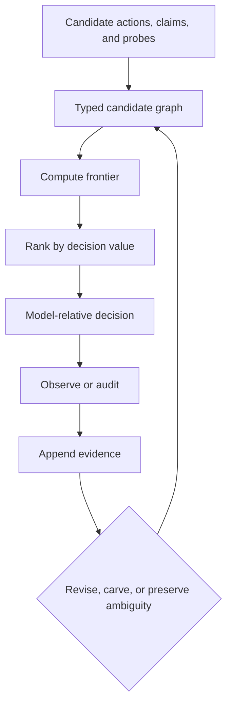

# Architecture

Metamorpher is a reference controller for a specific decomposition:

> relevance proposal → structural admissibility → decision value → observation
> → evidence/structure revision

It is designed to make these operations independently replaceable and
independently testable. A language model can propose content, but it is not the
authority that silently defines feasibility, evidence, and execution at once.

## Control loop

One pass around this loop does not imply that the controller returns to the same
state. Evidence, graph epochs, unresolved cells, domain memory, and audit history
accumulate. The implementation models that history explicitly instead of
requiring a geometric metaphor.

## Layers

### 1. Candidate proposal

A proposer supplies actions, tests, claims, and possible relations. The proposer
may be handwritten, retrieved, generated by an LLM, or learned. Candidate
relevance is not permission to execute.

### 2. Typed action graph

`TypedActionGraph` distinguishes:

- hard prerequisites;
- externally governed safety constraints;
- evidence-dependent guards;
- alternatives and mutual exclusions;
- soft epistemic-dominance relations.

Hard relations define admissibility. Soft relations influence ranking only.
Graph validation rejects missing references and structural cycles. Graph epochs
never repeat, so a decision produced before a revision can be recognized as
stale.

### 3. Frontier

For each pending action, the graph returns one of three structural positions:

- `certified`: all represented hard conditions are satisfied;
- `refinement`: no represented condition is violated, but at least one is
  unknown;
- `blocked`: at least one represented condition is violated.

Here, `certified` is an internal graph term. A public decision is named
`supported_under_model` to avoid implying external safety certification.

### 4. Decision value

A policy ranks only actions already exposed by the frontier. The transparent
reference heuristic combines information value, downstream decision value,
unlock value, soft epistemic preferences, cost, harm, and delay. It is not
claimed to be exact Bayes-risk planning.

A learned scorer may replace the heuristic, but it receives no authority to
unmask a blocked action. This separation turns represented feasibility into an
execution invariant rather than a distribution-dependent score.

### 5. Evidence

`EvidenceLedger` is append-only. Each observation includes a source,
reliability, domain, and censoring state. Censored observations remain recorded
but are excluded from positive/negative resolution:

> unobserved ≠ absent

Conflicting observations resolve to uncertainty when their weighted support is
too close. The raw events remain available for audit even when a current fact is
summarized.

### 6. Version spaces and unresolved cells

An `UnresolvedCell` represents cases that current observations cannot separate.
It stores compatible hypotheses and computes the intersection of their safe
actions. It does not assert that the cases share a discovered hidden cause.

If all surviving hypotheses share an action, the controller may expose that
common-safe action. Otherwise it refines or abstains. New evidence may later
carve the cell; it may also remain unresolved indefinitely.

### 7. Memory and audits

Reusable claims are stored with domain tags and evidence provenance. They are
conditional records, not universal truths. Independent audits are scheduled
outside the ordinary value policy so that the current graph does not entirely
control the evidence used to validate itself.

Audits reduce self-confirming blindness but add cost. An unaudited outcome is
censored, not evidence that a hidden constraint is absent.

## Model-relative decision state

A high-level decision carries:

- status: supported under model, refinement required, or abstain;
- selected action or represented probe;
- frontier and blockers;
- graph epoch and evidence revision;
- domain tag;
- assumptions, surviving hypotheses, and common-safe actions;
- a token that can be invalidated by subsequent revision.

The decision is a structured argument about the current model. It is not an
external execution capability.

## CPU and accelerator boundary

The Python CPU path defines semantics. Accelerator backends may batch frontier
evaluation and scoring, but they must preserve:

- discrete hard masks;
- unknown versus violated conditions;
- deterministic tie-breaking;
- non-finite score rejection;
- CPU fallback when an accelerator environment is unavailable, and explicit
  errors for unsupported runtime shapes.

Evidence ingestion, provenance, graph transactions, and external authorization
remain control-plane operations. See [CUDA and Triton](cuda-triton.md).

## Extension boundary

Provider-specific integrations should depend on small protocols rather than the
core depending on an SDK:

- proposer: creates untrusted candidate structure;
- scorer: ranks an already admissible set;
- observer: converts a tool response into a provenance-bearing observation;
- executor: consumes a separately authorized decision.

The core has no network dependency. An adapter should be removable without
changing graph, evidence, or decision semantics.

## What the architecture cannot infer automatically

The controller cannot guarantee that its graph contains every real prerequisite
or that its sensors expose every consequential distinction. Increasing latent or
tensor dimension cannot reconstruct information that was never observed. The
architecture can preserve ambiguity, request represented probes, audit, and
abstain; it cannot manufacture identifiability.
