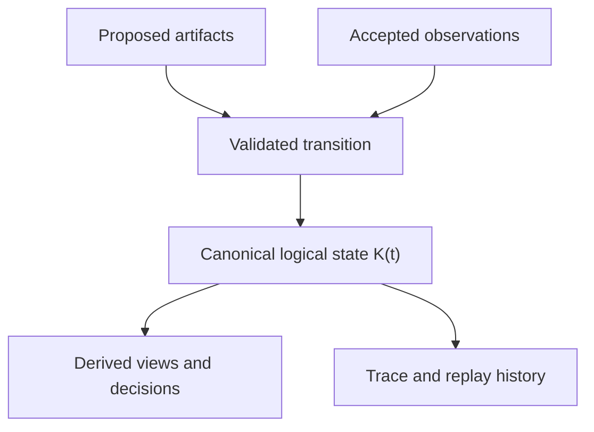

# Canonical logical knowledge state

Metamorpher currently distributes state across several deliberately narrow
objects. Those objects are not competing knowledge stores. Together they form
one **logical knowledge state**:

```text
K(t) = (G, E, U, C, L)
```

where:

- `G` is the active represented structure;
- `E` is accepted evidence and its provenance;
- `U` is unresolved hypothesis state;
- `C` is control and execution history;
- `L` is accumulated learner state that may propose a future update.

This is a documentation-level model, not a `KnowledgeState` class in the
current API. No individual component is a complete account of what the system
currently knows. A snapshot is coherent only when these components refer to the
same accepted transition history.

## Authority rule

Information becomes part of active runtime knowledge only through a controller
transition that accepts evidence, applies a validated structural revision,
updates an unresolved cell, or records an action outcome. Detail, confidence,
reuse, or presence in another registry does not grant authority.

The logical flow is:



`K(t)` is canonical as a composition. The implementation remains intentionally
split so that evidence, structure, uncertainty, and execution cannot silently
authorize one another.

## Authoritative components

| Logical component | Current implementation | What it authorizes |
|---|---|---|
| Represented structure `G` | `TypedActionGraph` | Nodes and constraints used to compute structural admissibility. Its epoch invalidates decisions after graph revision. |
| Accepted evidence `E` | `EvidenceLedger` | Provenance-bearing observations used to resolve guards, support revisions, and narrow hypotheses. Its revision invalidates stale decisions. |
| Uncertainty state `U` | `VersionSpaceManager` and active `UnresolvedCell` objects | Surviving represented hypotheses and their common-safe action intersection, scoped by domain. |
| Control state `C` | `ControllerState` plus the controller's issued and committed directive | Action status, irreversible effects, and the exact decision currently eligible for commitment or observation. |
| Learner state `L` | `AdaptiveLearningLoop`, `AdaptiveLearningRouter`, and their `AdaptiveFailureCarver` case history | Accumulated cases that can produce a candidate unresolved cell. It affects authority only when the controller atomically installs the learned cell. |

A model-relative decision is valid against the joint state, not merely against
the graph. Decision freshness binds graph epoch, evidence revision, and the
complete active version-space digest; commitment additionally checks current
control state.

## Derived, replay, and diagnostic views

These objects are important but are not independent authorities:

| Object | Role relative to `K(t)` |
|---|---|
| `DomainMemory` / `MemoryRecord` | Domain-scoped summary derived from accepted Boolean or censored observations. It is proposal context and reusable provenance, not a second evidence ledger. |
| Resolved evidence facts | Cached or computed summaries of `EvidenceLedger`; conflicting and raw events remain authoritative. |
| `FrontierResult` | A derived view of `G + E + C` at one instant. |
| `Decision` and decision token | A certificate over a snapshot of the joint state, not durable knowledge. |
| `ObservationReceipt` and `RevisionResult` | Transition receipts describing what changed; they do not replace the changed components. |
| `TraceLog` / trace events | Append-only diagnostic history. Trace data explains transitions but is not consulted as permission. |
| Observation replay journal | Recovery mechanism that reapplies accepted post-checkpoint batches so learner-derived state cannot lag behind evidence. |
| Controller checkpoint | A coordinated snapshot boundary. Restoring it changes the active structural/control state and then replays newer accepted observations by the documented rollback policy. |
| `AuditPolicy` | A schedule for acquiring evidence outside ordinary value ranking. Only the resulting accepted `Observation` enters `E`. |

## Proposed and quarantined artifacts

The following objects may influence attention or request a transition, but do
not belong to active runtime knowledge until their evidence is accepted through
the appropriate boundary:

| Object | Status before acceptance |
|---|---|
| `CandidateStructure` | Untrusted proposed nodes, constraints, and hypotheses. |
| Candidate `Constraint` | Present in a quarantine tier; not equivalent to supported or external-policy structure. |
| `ConstraintRevision` | Transaction request. It becomes active only after evidence validation and atomic application to `G`. |
| `Hypothesis` outside an active `UnresolvedCell` | Represented possibility, not a runtime permission. |
| `ExpansionCapsule` / `ExpansionRegistry` | Outer-loop proposal and its support status. Promotion records evidence for an expansion but does not currently install a new runtime representation into the controller. |
| `RepresentationBoundary` | Description of demonstrated scope and residuals; it does not itself alter admissibility. |
| `ResidualSignature` | Attributable failure that motivates investigation, not support for its proposed explanation. |
| `LocalEvidencePacket` | Prioritized investigation packet; routing priority is not authority. |
| `PrimitiveRegistry` / `PrimitiveRecord` | Qualification record for frozen structural operations. Qualification permits composition, not activation of composed output. |
| `PrimitiveCall` / `CandidateStructure` emitted by a primitive | Proposed computation and result, still subject to the ordinary quarantine boundary. |
| `CapsuleStore` / `StructuralCapsule` | Reusable, domain-bounded proposal context. Reuse does not bypass evidence or controller installation. |
| Text and discourse interpretations | Provenance-bearing observations or proposed structure after validation; interpreter output is never truth by declaration. |

## State transitions

Only a small set of operations changes the canonical logical state:

1. **Propose** — creates a quarantined artifact; `K(t)` is unchanged.
2. **Issue** — derives a decision certificate; durable knowledge is unchanged.
3. **Commit** — binds one currently valid directive in `C`.
4. **Observe** — atomically accepts an observation batch into `E`, updates
   applicable summaries and uncertainty state, applies validated revisions to
   `G`, publishes eligible learner output, and closes the committed action.
5. **Audit** — follows the same observation boundary without an action token,
   subject to independent-audit rules.
6. **Rollback/replay** — restores a coordinated checkpoint and deterministically
   reapplies accepted later observation batches under the documented structural
   rollback policy.

A future physical `KnowledgeState` aggregate should preserve these transition
boundaries. It should not flatten proposal, evidence, structure, derived caches,
and execution state into one mutable dictionary.

## Ownership boundaries

Components outside `MetamorpherController` can be grouped by their relationship
to the logical state:

- **Input adapters:** perceivers, interpreters, proposers, discriminators,
  observers, and executors provide candidates or external results.
- **Policies:** rank an already admissible frontier; they do not mutate
  `K(t)`.
- **Outer-loop representation tools:** boundaries, capsules, residuals, and
  packets organize candidate expansion but are not yet integrated runtime
  structure.
- **Accelerator backends:** compute derived frontier/value operations and cannot
  mutate symbolic authority.
- **Serialization and tracing:** preserve or explain state; they do not create
  support.

## Invariants for future consolidation

Any implementation refactor toward a concrete aggregate must preserve:

- one accepted-observation provenance history;
- atomic evidence, graph, uncertainty, learner, and action-outcome transitions;
- proposal quarantine;
- domain-scoped hypothesis activation;
- stale-decision invalidation after any authority-relevant change;
- explicit separation between active state, derived caches, and trace history;
- the current limitation that promoted expansion metadata is not automatically
  installed as controller structure.

This model answers “what does Metamorpher currently know?” without treating any
single registry as the answer: it is the coherent, transition-aligned tuple
`K(t)`.
